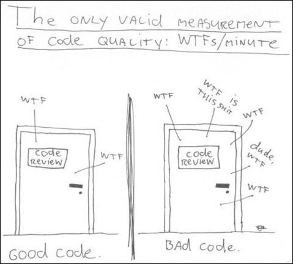
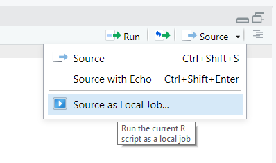
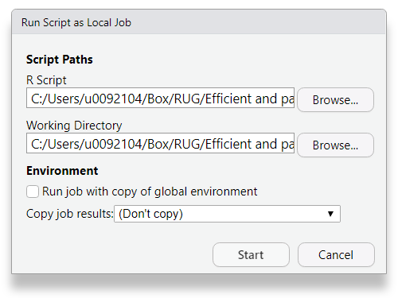
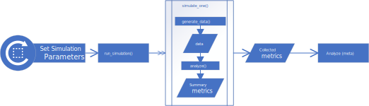

```{css, echo=FALSE}
slide img {
}
img.right {
    max-width: 500px;
    max-height: 500px;
    float: right;
}
footnote {
    font-size:75%;
}
img.thumb {
    float:left;
    height:1.5em;
}
```

```{r setup, include=FALSE, cache=FALSE}
library(tidyverse)
library(glue)
library(assertthat)
library(lubridate)
source("Simulation 1/Simulation_Setup.R")
knitr::opts_chunk$set(echo = TRUE, cache=TRUE)
```

# Motivation ($$$)

## Efficiency & why we care?

{.right}

- Time is money

## Efficiency & why we care?

{.right}

- Time is money
- Do more with less


## Programmer Time vs Computer Time.
```{css, echo=FALSE}
span.huge{font-size:150%;}
```
- `Cost(Time(Programmer))`<span class="huge">&gt;&gt;</span>`Cost(Time(Computer))`

{.right}

## Programmer Time vs Computer Time

- `Cost(Time(Programmer))`<span class="huge">&gt;&gt;</span>`Cost(Time(Computer))`
- `Cost(Programmer)`<span style="font-size:150%">&gt;&gt;</span>`Cost(Computer)`


# Efficient Project Workflow

## Top Tips

1. Start with the end in mind.
2. Make a plan
3. Pick your tools carefully.
4. Document you work.
5. Make your work reproducible.

<footnote>Adapted from *Efficient R Programming*, C Gillespie and R Lovelace, 2016, Chapter 4.</footnote>

## Start with the end in mind

{.right}

> - Keep objectives in the front of your mind.
>   + Publication
>   + Methods
>   + Package development
>   + Reproducible workflow vs. One off.
> - We left tangents behind in Geometry, don't follow them now


## Make a plan

{.right}

> - Statistical Analysis Plan
> - Statement of scope
> - Diagrams
>     + UML Class
>     + Process flow 
>     + swim lanes


## Pick your tools

{.right}

> - R is not always the right tool
> - Python is sometimes right
> - SAS even even has advantages at times

## Pick your tools

{.right}

- R is not always the right tool
- Python is sometimes right
- SAS even even has advantages at times

In all seriousness; Tools:

> - Which Packages
> - Write & Compile code
> - MCMC, BUGS, Bootstrapping, or Simulation?


## Document your work

- If you can't understand it neither will anyone else.
- `Programmer time >> Computer time`

{.right}

## Document your work
```{css blockquote, echo=FALSE}
blockquote {background: #f9f9f9;
  border-left: 10px solid #ccc;
  margin: 1.5em 10px;
  padding: 0.5em 10px;
  quotes: "\201C""\201D""\2018""\2019";
}
blockquote:before {
  color: #ccc;
  content: open-quote;
  font-size: 4em;
  line-height: 0.1em;
  margin-right: 0.25em;
  vertical-align: -0.4em;
}
blockquote p {
  display: inline;
}
```

- If you can't understand it neither will anyone else.
- `Programmer time >> Computer time`

> If ever faced with the choice between code you can understand 
> and code that is fast choose code you can understand.


# Efficient Programming

## Myth

> Efficient code is Verbose.

## Truth

> Every new line of code you willingly bring into the world is code 
> that has to be debugged, code that has to be read and understood, 
> code that has to be supported. Every time you write new code, you 
> should do so reluctantly, under duress, because you completely 
> exhausted all your other options.


## R's Cardinal Sin

{.right}

- Never, 
  <span style="font-size:150%">Never</span>, 
  <span style="font-size:200%">Never</span>
  grow vectors.

## Example

```{r}
system.time({
  x <- logical(0)
  i <- 1L
  while (i <= 10000000){
      x[[i]] <- rnorm(1) > 0
      i <- i + 1L
  }
})
```

- At each iteration x grows in length by 1, ie.
    + Check if there is space for another number
    + if not, create a new vector that has space (a reallocation)
- There are thousands is not millions of reallocations in this call.


## Solution: Vectorize

```{r}
system.time({
  x <- rnorm(10000000) > 0
})
```

- Let R figure out the best way to allocate
- Think in vectors & lists
- Get to compiled code as quickly as possible.

# Tool: Mapping
{.right}

## Mapping (thinking in vectors)
{.thumb}

- Apply the same function/operation/etc to _________
    + Element of a List/Vector
    + Subset of data.
    + Each set of parameters.
    
## Mapping Example Demographics

+ *For each* Diagnosis, compute:
    + Total number of patients
    + Age at time of Diagnosis
    + Sex breakdown
    + Racial breakdown
    + Total amount of antibiotics
    + Number of unique antibiotics
    + Etcetera.

## Mapping Example Simulation

+ Create a list of parameters you are interested in.
+ **For each** set of parameters generate a data set then
    * fit a model to the data,
    * compute summary statistics for fit,
    * generate plots for
        - Goodness of fit
        - outliers
        - Etcetera.
+ Compare the summary statistics across sets of parameters.

# Tool: Parallel Programming
{.right height=350px}

## What is parallel programming {.thumb}


Modern Computers have processor that can do many things independently 
at the same time.  This computer can do 

```{r}
parallel::detectCores()
```

things things at the same time.  This is one way there are other things running on 
the machine at the same time, such as windows, chrome, this presentation etc.

Parallel programming is telling 1 program to do multiple things at once.


## Simplest Parallel Programming: <br/> Running in the background



- Run on local machine
- Keep doing other things
- Progress shown in Rstudio.

## Running in the background



- Results can be copied back to your environment.

## Simulation Example {.build}
 
We will use the [`Simulation_Setup.R`](./Simulation_Setup.R) and 
[`simulation1.R`](simulation1.R) files to run a simulation the effects
of estimating effects post variable selection.

{.fullwidth width=100% style="max-width=100%"}

## Running
```{r "sim1_setup"}
beta  <- sample(c(rep(c(-1,1),each=5),c(rep(0,40))))
Sigma <- .8**abs(outer(seq_along(beta), seq_along(beta), `-`))
```

```{r simulate_one, dependson='sim1_setup'}
system.time({
    simulate_one( 250, beta, Sigma
                , analyze=analyze_with_enet
                )
})
```

Running one iteration takes a little over a second, so simulating 100
replications should take about two minute, but in computing things don't
always scale like we expect.

## Running All

```{r sim1, dependson='sim1_setup'}
system.time({
    results <- run_simulation( m=100, n=250
                             , beta=beta, Sigma=Sigma
                             , analyze=analyze_with_enet)
})
```

## Running `simulation1.R` in batch {.build}

::: Explanation

*100* replications isn't bad but I want more like **1,000**.

> * I really dont want to lock down my Rstudio for 20 minutes with this,
> * so let's run it in batch mode.

:::

::: Howevers

However,

> * If you run without saving anything nothing changes.
> * Running with a 'copy job results' option will bring results back.
> * But...

:::

## Explicit Saving

### Single objects
```r
file <- format(now(), "results %Y%m%d-%H%M%S.rds")
```
::::::{.columns-2}
:::{.column}
#### Saving
```r
saveRDS(results, file)
# OR (fast write, but larger file)
writeRDS(results, file)
```
:::
:::{.column}
#### Reading
```r
# Read back to specific object
# & save to object
results <- readRDS(file)
```
:::
::::::

### With bindings (i.e. variable names)
```r
file <- format(now(), "results %Y%m%d-%H%M%S.RData")
```
::::::{.columns-2}
:::{.column}
```r
save.image(file)         #< Everything
save(results, file=file) #< Selectively
```
:::
:::{.column}
```r
load(file)               #< Global Env
load(file, results.env)  #< Specific Env
```
:::
::::::

## MORE! {.build}

### Problem

That was one parameter set.


### Solution

Run lots of batchs

### But

We don't want to create a file for each set of parameters


## Altering batch processes {.build}

Batch scripting may be altered by passing command line arguments 
(though not easily through RStudio)

::::::{.columns-2}
:::{.column}
#### Linux
```sh
R CMD BATCH simulation1.R --args 1
```
:::
:::{.column}
#### Windows
```sh
Rterm BATCH simulation1.R --args 1
```
:::
::::::

### Output
```rout
> commandArgs()
[1] "C:\\Program Files\\R\\R-3.6.2\\bin\\x64\\rterm.exe"
[2] "-f"                                                
[3] "commandArgs.R"                                     
[4] "--args"                                            
[5] "1"                                                 
> commandArgs(TRUE)
[1] "1"
```


## Spawn multiple jobs

::::::{.columns-2}
:::{.column}
#### Linux
```sh
Rscript simulation2.R 1 &
Rscript simulation2.R 2 &
Rscript simulation2.R 3 &
Rscript simulation2.R 4 &
```
:::
:::{.column}
#### Windows
is "complicated"
:::
::::::

### Note 

This is relevant to know for CHPC.

## Timing for four
```{r include=FALSE}
unlink("Simulation 2/parameters.rds")
unlink("Simulation 2/*.rds")
unlink("Simulation 2/*.err")
unlink("Simulation 2/*.out")
```

```{r, root.dir = "Simulation 2"}
start <- proc.time()
withr::with_dir("Simulation 2/", {
    system2(Sys.which("Rscript"), "simulation2-setup.R", wait=TRUE)
    system2(Sys.which("Rscript"), c("simulation2.R", "1"), "1.out", "1.err" , wait=FALSE)
    system2(Sys.which("Rscript"), c("simulation2.R", "2"), "2.out", "2.err" , wait=FALSE)
    system2(Sys.which("Rscript"), c("simulation2.R", "3"), "3.out", "3.err" , wait=FALSE)
    system2(Sys.which("Rscript"), c("simulation2.R", "4"), "4.out", "4.err" , wait=FALSE)
})
# Wait for files.
expected <- glue("Simulation 2/results-{1:4}.rds")
while (any(!file.exists(expected))) Sys.sleep(0.001)
proc.time()-start
```


# Going Parallel

## Going Parallel {.build}

* We've gone paralell in a cludgy sort of way.
* we want something elegant. 

There are two main paths

::::::{.columns-2}
:::{.column}
#### foreach
+ Straight forward
+ Explicit
+ More changes to code
+ Older
:::
:::{.column}
#### future
+ Uses parallelized 'promises'
+ Implicit
+ Code looks more similar to serialized code
+ New interface
:::
::::::

## `foreach` paradigm

### Setup

* We need a set of workers (cluster)
    - processes that can handle the computations.
* Special functions handle delegating computations to the group.
* The main package is [foreach](https://cran.r-project.org/package=foreach)

## Clusters

- [doParallel](https://cran.r-project.org/package=doParallel) - Interfaces a cluster communicating over sockets.
- [doMC](https://cran.r-project.org/package=doSNOW) - Interfaces a cluster utilizing multiple cores of a single processor.
- [doSNOW](https://cran.r-project.org/package=doSNOW) - Interfaces a 'snow' cluster, simple network of workstations.
- [doMPI](https://cran.r-project.org/package=doMPI) - Cluster communicating over message passing interface (MPI).  Typical in High performance computing clusters but is overkill for most statistics applications. *Requires extensive out of R configuration of the cluster.*


## Steps to parallel

### Create Cluster
```{r register, cache=FALSE}
cl <- parallel::makeCluster(4)
doParallel::registerDoParallel(cl)
```

### Evaluate in parallel
```{r}
library(foreach)
parameters <- readRDS('Simulation 2/parameters.rds') %>% 
    select(m,n,beta,Sigma) %>% 
    pmap(list)
system.time(try({
parallel.results <- 
    foreach(parm=parameters) %dopar%{
        do.call(run_simulation, parm)
    }
    
}))
```

## What happened.

The previous call failed because:

1. There are 4 separate instances of R running.
2. Each maintains a separate workspace.
3. Packages must be loaded on each worker

## Fixed

```{r foreach}
system.time(try({
parallel.results <- 
    foreach( parm=parameters
           , .packages=c('tidyverse', 'assertthat', 'elasticnet')
           ) %dopar%{
        do.call(run_simulation, c(parm,list(analyze=analyze_with_enet)))
    }
    
}))
```


## Future approach

parallelism is achieved through registering a plan or strategies.

+ sequential (default)
+ transparent - essentially the same as sequential
+ multisession - multiple R sessions on host computer
+ multicore - forked R Processes, not available on Windows. 
+ multiprocess - shortcut for multicore if available, otherwise multisession.
+ cluster - Heterogeneous cluster of machines
+ remote - Simply run on remote session.


## Example

```{r, echo=FALSE, cache=FALSE}
my.functions <- c( 'compute_performance_statistics'
                                                       , 'simulate_one'
                                                       , 'run_simulation'
                                                       , 'analyze_with_enet'
                                                       , 'with_timing'
                                                       , 'generate_data'
                                                       )
```
```{r furrr}
library(furrr)
plan(multiprocess)
system.time({
results <- readRDS("Simulation 2/parameters.rds") %>% 
    select(m,n,beta, Sigma) %>% 
    future_pmap(run_simulation, analyze=analyze_with_enet
               , .options = future_options( globals = my.functions
                                          , packages=c('tidyverse', 'elasticnet', 'assertthat')) )
})
```

